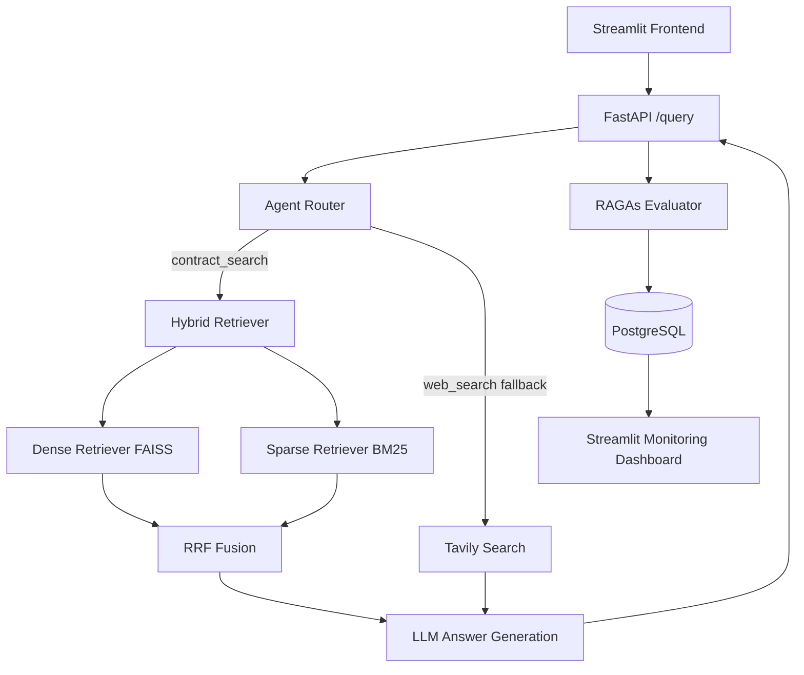

# Legal Contract Analyzer

Agentic RAG system for contract intelligence with hybrid retrieval, tool-routing, evaluation, monitoring, and production deployment.

Tech stack: Python 3.11, LangChain, FAISS + BM25 (RRF), FastAPI, Streamlit, RAGAs, PostgreSQL, Docker, AWS ECS Fargate, Terraform, GitHub Actions.

## Live Demo

- App URL: add deployed ALB URL after first ECS deploy
- Monitoring URL: add `/dashboard/` route after deploy

## Resume Bullet

Built a Legal Contract Analyzer using Agentic RAG (LangChain, FAISS + BM25, HuggingFace Qwen/Mistral) on CUAD (510 contracts); implemented hybrid retrieval, evaluated with RAGAs (faithfulness, answer relevance, context precision/recall), and deployed on AWS ECS Fargate with real-time monitoring.

## Problem Statement

Contract review is slow and expensive. This project automates clause discovery and grounded Q&A while explicitly addressing common RAG failure modes:

1. Wrong retrieval when answers span multiple clauses.
2. No fallback when the document lacks the answer.
3. No measurable quality signal.

This system solves these with hybrid retrieval (BM25 + dense), agentic tool routing (contract vs web), and RAGAs metric logging.

## Dataset (CUAD)

- Source: HuggingFace (`theatticusproject/cuad` with `cuad` fallback)
- Scale: 510 real contracts, 13k+ annotations, 41 clause categories
- Why CUAD matters: enables retrieval and answer quality evaluation against grounded legal spans

Load example:

```python
from datasets import load_dataset

ds = load_dataset("theatticusproject/cuad")

# If split-size verification fails in your environment:
# ds = load_dataset("theatticusproject/cuad", verification_mode="no_checks")
```

Note: this dataset variant exposes a PDF feature column in some environments. The loader in this project extracts contract text from those PDF rows automatically during ingestion.

## Architecture



## Why Hybrid Retrieval

- Dense retrieval handles semantic paraphrases.
- BM25 captures exact legal keywords and section references.
- Reciprocal Rank Fusion (RRF) merges heterogeneous ranking outputs without fragile score normalization.

RRF formula:

$$
	ext{RRF}(d) = \sum_i \frac{1}{rank_i(d) + 60}
$$

## Project Structure

```text
legal-contract-analyzer/
├── README.md
├── requirements.txt
├── .env.example
├── docker-compose.yml
├── Makefile
├── data/
│   ├── raw/
│   ├── processed/
│   └── eval_samples/
├── src/
│   ├── ingestion/
│   │   ├── __init__.py
│   │   ├── loader.py
│   │   ├── chunker.py
│   │   └── embedder.py
│   ├── retrieval/
│   │   ├── __init__.py
│   │   ├── dense_retriever.py
│   │   ├── sparse_retriever.py
│   │   └── hybrid_retriever.py
│   ├── agent/
│   │   ├── __init__.py
│   │   ├── tools.py
│   │   ├── agent.py
│   │   └── prompts.py
│   ├── evaluation/
│   │   ├── __init__.py
│   │   ├── ragas_evaluator.py
│   │   ├── run_eval.py
│   │   └── metrics_store.py
│   ├── api/
│   │   ├── __init__.py
│   │   ├── main.py
│   │   ├── routes/
│   │   │   ├── __init__.py
│   │   │   ├── query.py
│   │   │   ├── upload.py
│   │   │   └── metrics.py
│   │   └── schemas.py
│   └── monitoring/
│       ├── __init__.py
│       └── dashboard.py
├── frontend/
│   └── app.py
├── tests/
│   ├── test_retrieval.py
│   ├── test_agent.py
│   └── test_api.py
├── infra/
│   ├── Dockerfile
│   └── terraform/
│       ├── main.tf
│       ├── ecr.tf
│       ├── rds.tf
│       ├── alb.tf
│       └── variables.tf
└── .github/
		└── workflows/
				└── ci-cd.yml
```

## Quick Start

1. Install dependencies.

```bash
pip install -r requirements.txt
```

2. Configure environment.

```bash
cp .env.example .env
```

3. Build retrieval artifacts from CUAD.

```bash
make ingest
```

4. Start local stack.

```bash
make run
```

5. Open services.

- API docs: `http://localhost:8000/docs`
- Frontend: `http://localhost:8501`
- Dashboard: `http://localhost:8502`

## API Endpoints

- `POST /query`
	- Input: `{ "query": "...", "contract_id": "optional" }`
	- Output: answer, source chunks, citations, tool used, routing reason
- `POST /upload`
	- Upload custom `.txt` or `.pdf`, auto-indexes and refreshes retrievers
- `GET /metrics`
	- Returns recent metric rows, trends, and routing analytics

## Evaluation (RAGAs)

Batch flow:

1. Build sample set (`data/eval_samples/`).
2. Run evaluator.
3. Persist metrics to PostgreSQL.
4. Visualize trends in dashboard.

Run:

```bash
python -m src.evaluation.run_eval --build-samples --sample-size 100
```

Target benchmark table:

| Metric | Dense Only | Hybrid | Target |
|---|---:|---:|---:|
| Faithfulness | 0.82 | 0.91 | > 0.90 |
| Answer Relevance | 0.79 | 0.87 | > 0.85 |
| Context Precision | 0.71 | 0.83 | > 0.80 |
| Context Recall | 0.68 | 0.76 | > 0.75 |

## Monitoring Dashboard

Dashboard features:

- Metric trend lines over configurable time windows
- Last N query table with tool routing and fallback flags
- Faithfulness threshold alert (red below 0.90)
- Query analytics by tool usage frequency

## Docker and Local Orchestration

- Multi-stage Docker build in `infra/Dockerfile`
- `docker-compose.yml` runs:
	- FastAPI backend
	- Streamlit user app
	- Streamlit monitoring app
	- PostgreSQL

## AWS Deployment (ECS Fargate)

Provisioned by Terraform:

- ECR repos for API/dashboard images
- ECS cluster and Fargate services
- ALB path routing (`/api/*`, `/dashboard/*` patterns can be added in listener rules)
- RDS PostgreSQL for metric logs
- S3 bucket for FAISS artifact persistence
- Secrets Manager for API keys

Important production decision:

- FAISS index is built once and persisted to S3, then loaded at startup to avoid repeated embedding cost and long cold starts.

## CI/CD

Workflow: `.github/workflows/ci-cd.yml`

On push to `main`:

1. Run tests.
2. Build and push API/dashboard images to ECR.
3. Trigger ECS rolling redeploy.

Required GitHub secrets:

- `AWS_REGION`
- `AWS_ROLE_TO_ASSUME`
- `ECR_REPOSITORY_API`
- `ECR_REPOSITORY_DASHBOARD`
- `ECS_CLUSTER`
- `ECS_SERVICE_API`
- `ECS_SERVICE_DASHBOARD`

## Design Decisions

1. RAG over fine-tuning:
	 legal documents change frequently, so externalized retrieval is cheaper and easier to update.

2. Hybrid over dense-only:
	 legal wording has both semantic variance and exact term sensitivity.

3. Agentic routing:
	 contract-grounded answers first, web fallback when document context is absent.

4. Measurable quality:
	 RAGAs + logged trend lines catch regressions before production incidents.

## Sample Queries

- What is the indemnification limit in this contract?
- Is there a termination for convenience clause?
- What obligations survive termination?
- Compare liability cap language between two uploaded contracts.
- What is the typical indemnity cap in SaaS deals? (web fallback)

## Development Commands

```bash
make install
make ingest
make api
make frontend
make dashboard
make eval
make test
```
